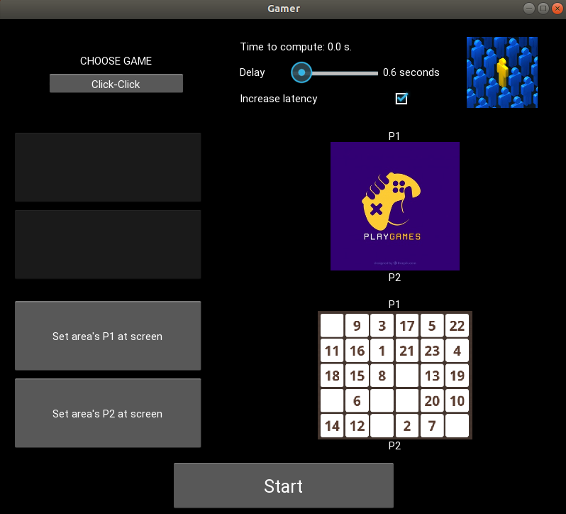

# Gamer
* Application play game "Click-Click" on the web-site wikium.ru
* https://youtu.be/fFdEUFhySUw

### Prerequisites
* python 3
* Kivy v1.11
* OpenCV v2 or v3 or v4
* pynput v1.6
* PyAutoGUI v0.9
* pytesseract v0.3
* imutils (better the last version)

### Run application
* to run application in terminal: python main.py

### Application printscreens

### Links
* Who are interesting with computer vision I recommending this place: www.pyimagesearch.com

### Author
* MarsLviv - *matsars@gmail.com*
